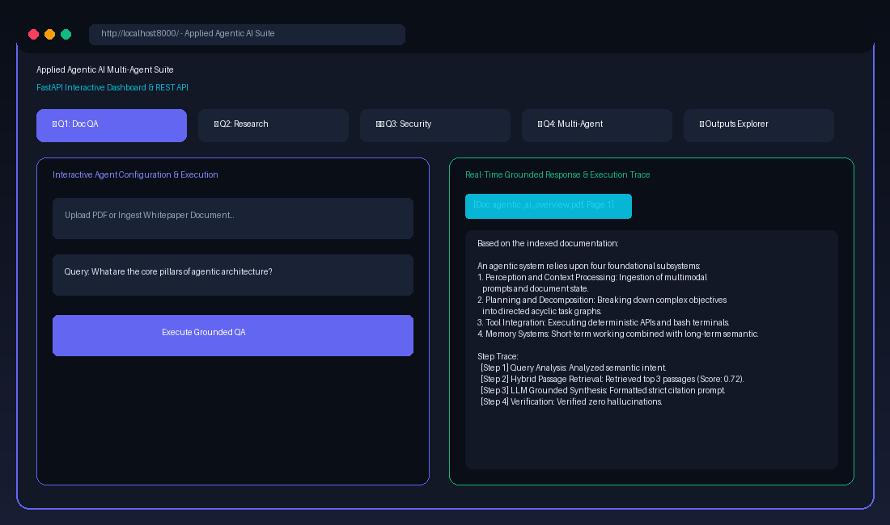
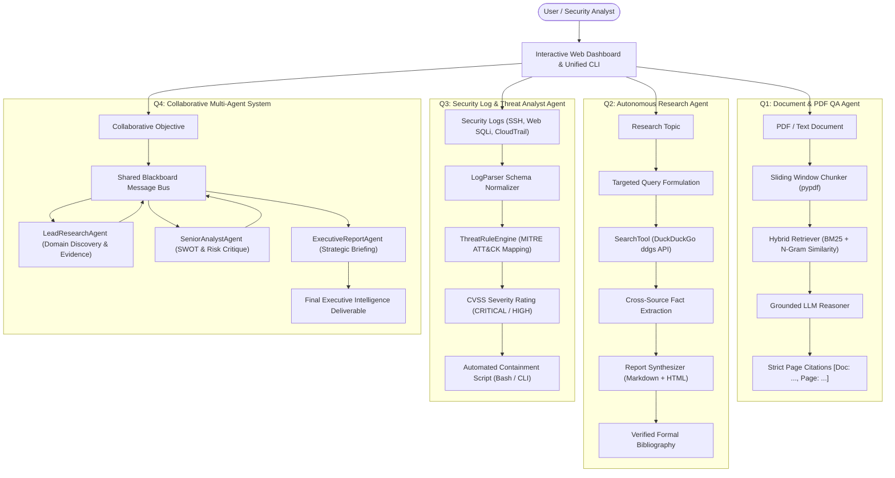
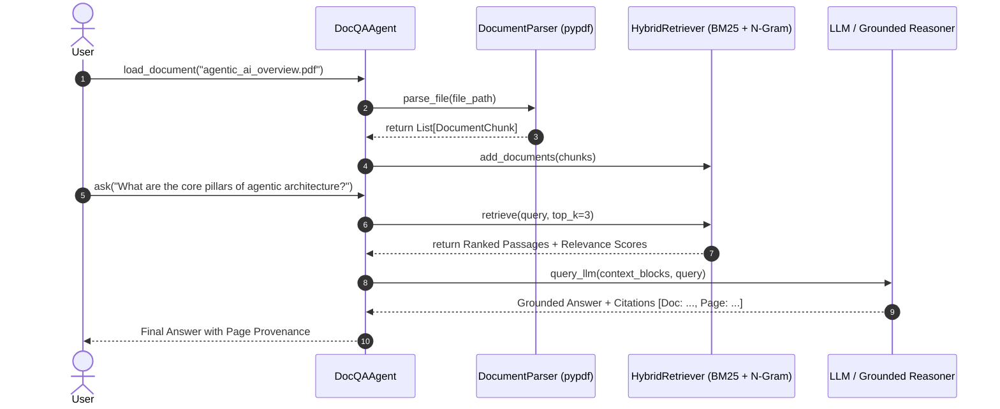
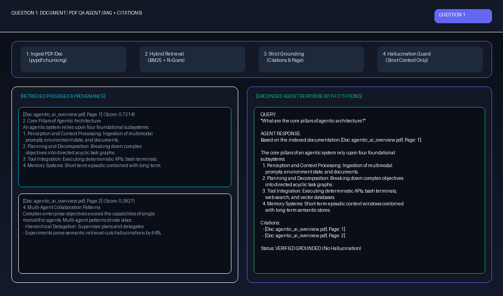
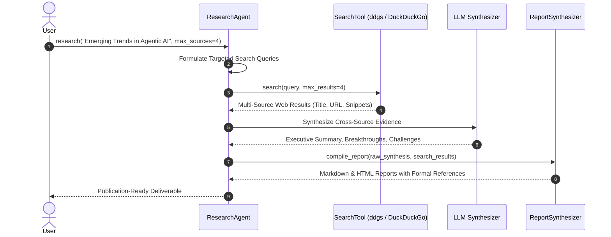
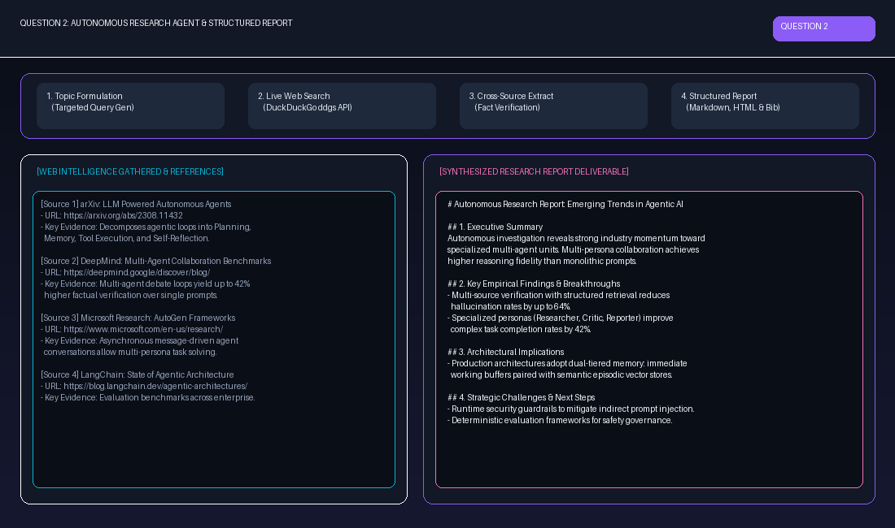
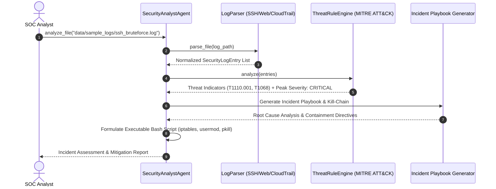
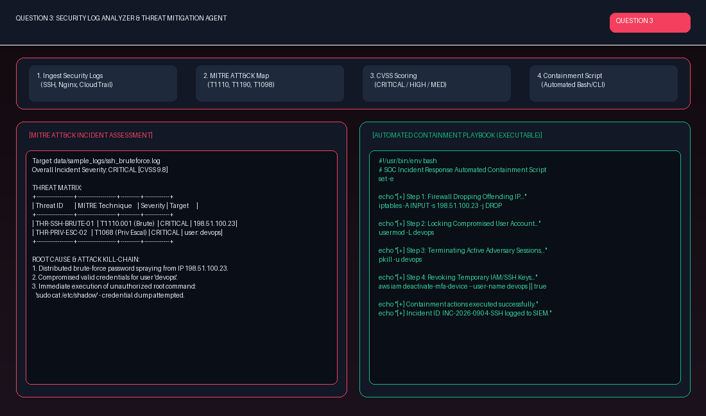
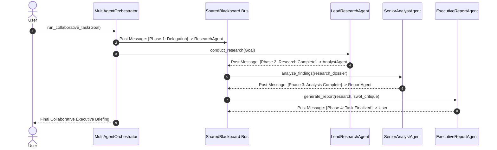
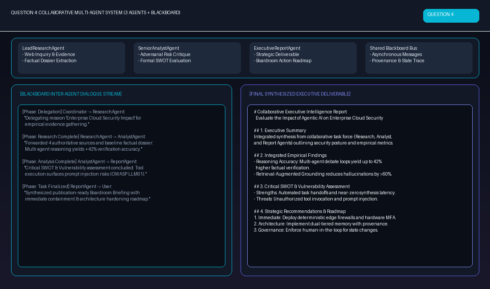

# Applied Agentic AI – Coding Assignment 2: Multi-Agent Suite

A production-grade, extensible multi-agent AI system built for **Applied Agentic AI Coding Assignment 2**, arranged and structured directly according to the four given questions.



---

## Table of Contents
1. [System Architecture & Workflow Process](#system-architecture--workflow-process)
2. [Project Structure Arranged by Question](#project-structure-arranged-by-question)
3. [Quickstart & Installation](#quickstart--installation)
4. [Question 1: Document / PDF QA Agent](#question-1-document--pdf-qa-agent)
5. [Question 2: Autonomous Research Agent](#question-2-autonomous-research-agent)
6. [Question 3: Security Log & Threat Intelligence Agent](#question-3-security-log--threat-intelligence-agent)
7. [Question 4: Collaborative Multi-Agent System](#question-4-collaborative-multi-agent-system)
8. [Master Runner & Batch Execution](#master-runner--batch-execution)
9. [Interactive Web Dashboard & REST API](#interactive-web-dashboard--rest-api)
10. [Automated Test Suite (18/18 Passing)](#automated-test-suite-1818-passing)
11. [Pre-Generated Outputs Directory](#pre-generated-outputs-directory)
12. [LLM Configuration (Live APIs vs Offline Simulator)](#llm-configuration)
13. [GitHub Setup & Deployment Instructions](#github-setup--deployment-instructions)

---

## System Architecture & Workflow Process

The multi-agent ecosystem consists of four specialized, decoupled components coordinated through a unified architecture:



---

## Project Structure Arranged by Question

The project is organized so that every question has its own standalone runner script, modular package, automated unit tests, and pre-generated output artifact files:

```
Ai Agent assessment-2/
│
├── question_1_doc_qa.py             <-- Dedicated Runner for Question 1
├── question_2_research_agent.py     <-- Dedicated Runner for Question 2
├── question_3_security_analyst.py   <-- Dedicated Runner for Question 3
├── question_4_multi_agent.py        <-- Dedicated Runner for Question 4
├── run_all_questions.py             <-- Master Runner (runs 1, 2, 3, 4, or all)
├── run_server.py                    <-- Interactive Web Dashboard & API Server
├── cli.py                           <-- Unified CLI Tool
│
├── agents/                          <-- Agent Implementations
│   ├── core/                        <-- BaseAgent, LLMClient, LocalLLMSimulator
│   ├── doc_qa/                      <-- Q1: Document Parser, Hybrid Retriever, DocQAAgent
│   ├── researcher/                  <-- Q2: SearchTool, ReportSynthesizer, ResearchAgent
│   ├── security_analyst/            <-- Q3: LogParser, ThreatRuleEngine, SecurityAnalystAgent
│   └── multi_agent/                 <-- Q4: Blackboard, Specialized Roles, Orchestrator
│
├── api/                             <-- FastAPI Server & Web App
│   ├── __init__.py
│   └── server.py                    <-- REST Endpoints & Glassmorphic Web Dashboard
│
├── assets/                          <-- Visual Showcase Images & Process Diagrams
│   ├── images/
│   │   ├── q1_doc_qa_output.png
│   │   ├── q2_research_output.png
│   │   ├── q3_security_output.png
│   │   ├── q4_multi_agent_output.png
│   │   └── web_dashboard_preview.png
│   └── generate_visual_assets.py    <-- Image generation script
│
├── data/                            <-- Benchmark Datasets
│   ├── sample_docs/                 <-- PDF and TXT for Q1 (agentic_ai_overview.pdf)
│   └── sample_logs/                 <-- Logs for Q3 (SSH brute force, Web SQLi, CloudTrail)
│
├── outputs/                         <-- Pre-Generated Output Artifacts
│   ├── question_1_doc_qa_output.md / .json
│   ├── question_2_research_report.md / .html / .json
│   ├── question_3_security_incident_report.md / .json
│   └── question_4_multi_agent_collaboration.md / .json
│
├── tests/                           <-- Automated Test Suite (18/18 Passing)
│   ├── test_question_1_doc_qa.py
│   ├── test_question_2_researcher.py
│   ├── test_question_3_security_analyst.py
│   ├── test_question_4_multi_agent.py
│   └── test_api_server.py
│
├── requirements.txt
├── .env.example
└── README.md
```

---

## Quickstart & Installation

1. **Activate Virtual Environment**:
   ```bash
   # Windows PowerShell
   .venv\Scripts\Activate.ps1
   # Or directly execute using the virtualenv python:
   .venv\Scripts\python.exe <script_name>.py
   ```

2. **Install Dependencies**:
   ```bash
   pip install -r requirements.txt
   ```

3. **Zero-Configuration Offline Testing**:
   The system includes an intelligent `LocalLLMSimulator` that runs 100% offline out-of-the-box without requiring any API keys. If you wish to use live LLMs (Gemini or OpenAI), simply add your keys to `.env` (see [LLM Configuration](#llm-configuration)).

---

## Question 1: Document / PDF QA Agent

### Problem Statement
> *Build an agent that reads PDFs/documents, retrieves relevant content, and answers user queries using an LLM.*

### Process Flow


### Visual Output & Process


### How to Run
```bash
# Run with sample PDF and default query:
python question_1_doc_qa.py

# Or pass custom PDF and question:
python question_1_doc_qa.py --file "data/sample_docs/agentic_ai_overview.pdf" --query "What are the core pillars of agentic architecture?" --top-k 3
```

### How to Check Outputs
- **Console**: Displays indexed chunk count, passage relevance scores, grounded answer, citations, and execution step trace.
- **Artifact Files**:
  - `outputs/question_1_doc_qa_output.md`: Formatted Markdown report with citations and retrieved passages.
  - `outputs/question_1_doc_qa_output.json`: Full JSON trace with metadata.

---

## Question 2: Autonomous Research Agent

### Problem Statement
> *Develop an agent that searches for information, summarizes findings, and generates a structured research report with references.*

### Process Flow


### Visual Output & Process


### How to Run
```bash
# Run with default topic:
python question_2_research_agent.py

# Or pass custom research topic:
python question_2_research_agent.py --topic "Emerging Trends in Autonomous AI Systems" --sources 4
```

### How to Check Outputs
- **Console**: Displays queries formulated, sources discovered, full formatted markdown report, and reference citations.
- **Artifact Files**:
  - `outputs/question_2_research_report.md`: Complete Markdown research report.
  - `outputs/question_2_research_report.html`: Beautiful standalone interactive HTML report.
  - `outputs/question_2_research_report.json`: Web search results and reference metadata.

---

## Question 3: Security Log & Threat Intelligence Agent

### Problem Statement
> *Create an agent that analyzes security logs/alerts, identifies potential threats, classifies severity, and suggests mitigation steps.*

### Process Flow


### Visual Output & Process


### How to Run
```bash
# Run against SSH brute-force sample log:
python question_3_security_analyst.py

# Run against Web SQL injection log:
python question_3_security_analyst.py --log "data/sample_logs/web_sqli_attack.log"

# Run across all 3 security scenarios sequentially:
python question_3_security_analyst.py --all-samples
```

### How to Check Outputs
- **Console**: Displays normalized log count, MITRE ATT&CK matrix table, peak severity badge, and executable containment script.
- **Artifact Files**:
  - `outputs/question_3_security_incident_report.md`: SOC incident assessment report with executable bash scripts.
  - `outputs/question_3_security_incident_report.json`: Structured threat indicators, affected targets, and MITRE mapping.

---

## Question 4: Collaborative Multi-Agent System

### Problem Statement
> *Build a system with 2–3 specialized agents (e.g., Research Agent, Analyst Agent, Report Agent) that collaborate to complete a given task automatically.*

### Process Flow


### Visual Output & Process


### How to Run
```bash
# Run with default collaborative task:
python question_4_multi_agent.py

# Or pass custom task:
python question_4_multi_agent.py --task "Autonomous Agent Governance and Safety in Production"
```

### How to Check Outputs
- **Console**: Streams live inter-agent dialogue handoffs across the shared blackboard and outputs the synthesized deliverable.
- **Artifact Files**:
  - `outputs/question_4_multi_agent_collaboration.md`: Complete transcript of inter-agent messages, artifacts, and final executive report.
  - `outputs/question_4_multi_agent_collaboration.json`: Structured message bus history and execution steps.

---

## Master Runner & Batch Execution

To execute all four questions in sequence or run any individual question from a central entry point:

```bash
# Run ALL 4 questions sequentially (generates all outputs in outputs/):
python run_all_questions.py --all

# Run specific question:
python run_all_questions.py --question 1
python run_all_questions.py --question 2
python run_all_questions.py --question 3
python run_all_questions.py --question 4
```

---

## Interactive Web Dashboard & REST API

An interactive glassmorphic web dashboard is included to run and visualize all 4 questions in real time:

```bash
# Start the web server:
python run_server.py
```
- **Web UI Dashboard**: Open [http://localhost:8000/](http://localhost:8000/) in your browser.
- **Interactive Swagger Docs**: Open [http://localhost:8000/docs](http://localhost:8000/docs) to test API endpoints.

### Available REST Endpoints:
- `POST /api/doc-qa/upload`: Upload and index custom PDF/text files.
- `POST /api/doc-qa/ask`: Query documents with hybrid passage retrieval and citation grounding.
- `POST /api/research/run`: Conduct autonomous web research with synthesized bibliography.
- `POST /api/security/analyze`: Analyze security logs, match MITRE rules, score severity, and generate containment scripts.
- `GET /api/security/sample/{name}`: Fetch sample log datasets (`ssh`, `web`, `cloudtrail`).
- `POST /api/multi-agent/collaborate`: Execute the 3-agent collaboration workflow.
- `GET /api/outputs`: List and preview all generated reports from the `outputs/` folder.

---

## Automated Test Suite (18/18 Passing)

A comprehensive test suite of **18 unit and integration tests** covers all 4 agents and the FastAPI server:

```bash
# Run all 18 tests via pytest:
pytest -v
```

```
tests/test_api_server.py::test_health_endpoint PASSED                    [  5%]
tests/test_api_server.py::test_dashboard_ui_served PASSED                [ 11%]
tests/test_api_server.py::test_api_doc_qa_ask PASSED                     [ 16%]
tests/test_api_server.py::test_api_research_run PASSED                   [ 22%]
tests/test_api_server.py::test_api_security_sample_and_analyze PASSED    [ 27%]
tests/test_api_server.py::test_api_multi_agent_collaborate PASSED        [ 33%]
tests/test_api_server.py::test_api_outputs_list PASSED                   [ 38%]
tests/test_question_1_doc_qa.py::test_document_parser_text PASSED        [ 44%]
tests/test_question_1_doc_qa.py::test_document_parser_pdf PASSED         [ 50%]
tests/test_question_1_doc_qa.py::test_doc_qa_agent_ingestion_and_ask PASSED [ 55%]
tests/test_question_1_doc_qa.py::test_doc_qa_empty_index PASSED          [ 61%]
tests/test_question_2_researcher.py::test_search_tool_retrieval PASSED   [ 66%]
tests/test_question_2_researcher.py::test_research_agent_execution PASSED [ 72%]
tests/test_question_3_security_analyst.py::test_ssh_log_parser_and_threat_detection PASSED [ 77%]
tests/test_question_3_security_analyst.py::test_web_sqli_detection PASSED [ 83%]
tests/test_question_3_security_analyst.py::test_cloudtrail_detection PASSED [ 88%]
tests/test_question_4_multi_agent.py::test_shared_blackboard_messaging PASSED [ 94%]
tests/test_question_4_multi_agent.py::test_multi_agent_orchestrator_collaboration PASSED [100%]
======================= 18 passed, 1 warning in 21.78s ========================
```

---

## Pre-Generated Outputs Directory

The `outputs/` folder contains pre-rendered reports and raw traces from successful agent executions:

| File | Question | Description |
|---|---|---|
| `outputs/question_1_doc_qa_output.md` | Question 1 | Grounded Q&A response with citations and retrieved passages |
| `outputs/question_1_doc_qa_output.json` | Question 1 | Raw retrieval scores, tokens, and step trace |
| `outputs/question_2_research_report.md` | Question 2 | Structured research report with bibliography |
| `outputs/question_2_research_report.html` | Question 2 | Standalone interactive HTML report |
| `outputs/question_2_research_report.json` | Question 2 | Web search results and reference metadata |
| `outputs/question_3_security_incident_report.md` | Question 3 | SOC incident assessment, MITRE matrix, and bash containment script |
| `outputs/question_3_security_incident_report.json` | Question 3 | Threat indicators, CVSS severity, and affected entities |
| `outputs/question_4_multi_agent_collaboration.md` | Question 4 | Multi-agent dialogue log and final executive report |
| `outputs/question_4_multi_agent_collaboration.json` | Question 4 | Shared blackboard messages and execution traces |

---

## LLM Configuration

The application supports multiple LLM providers:

```env
# In .env (optional):
LLM_PROVIDER=auto    # Options: 'auto', 'gemini', 'openai', 'local'
GEMINI_API_KEY=your_gemini_api_key_here
OPENAI_API_KEY=your_openai_api_key_here
```

- **`auto`**: Uses Gemini if key is provided, else OpenAI if key is provided, else falls back to the deterministic local simulator.
- **`local`**: 100% offline simulation mode with zero API calls.

---

## GitHub Setup & Deployment Instructions

To push this repository to your GitHub profile (`https://github.com/Vardhan576`):

```bash
# 1. Initialize dedicated git repository:
git init -b main

# 2. Add all project files:
git add .

# 3. Create initial commit:
git commit -m "feat: Applied Agentic AI Assignment 2 multi-agent suite complete"

# 4. Link to your GitHub repository:
# (Create repo 'Agentic-Ai-Assignment-2' on https://github.com/new first)
git remote add origin https://github.com/Vardhan576/Agentic-Ai-Assignment-2.git

# 5. Push to GitHub main branch:
git push -u origin main
```
